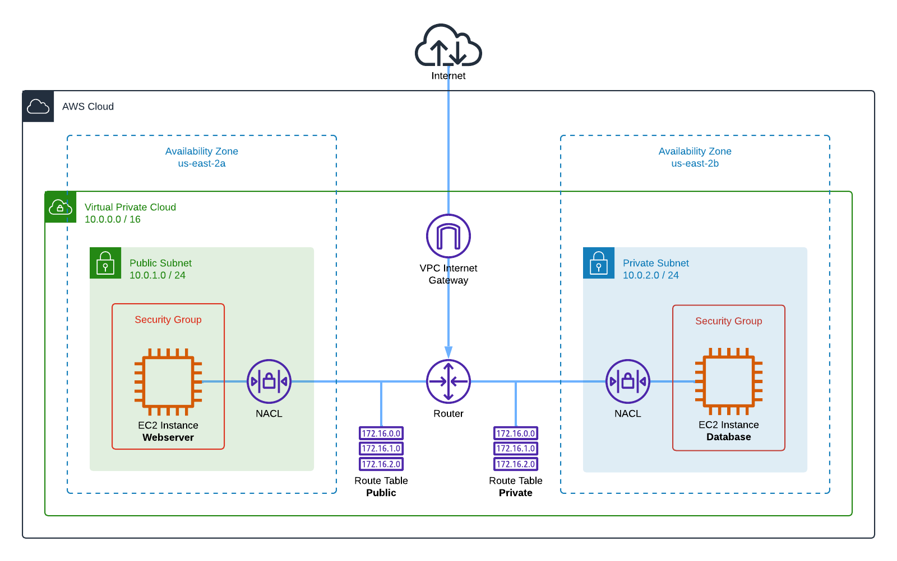
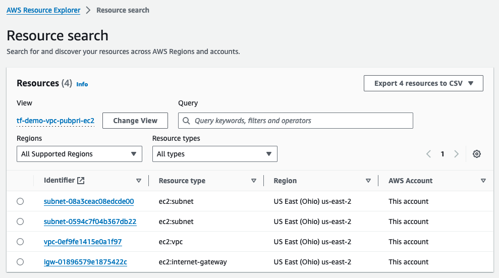
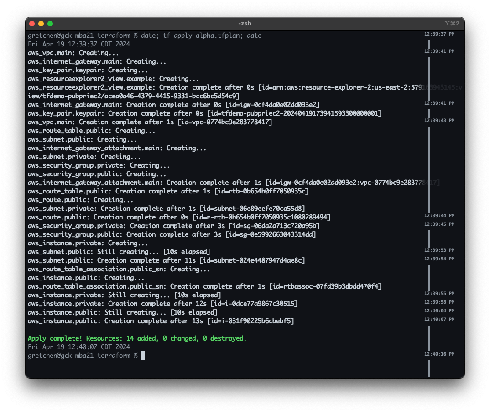
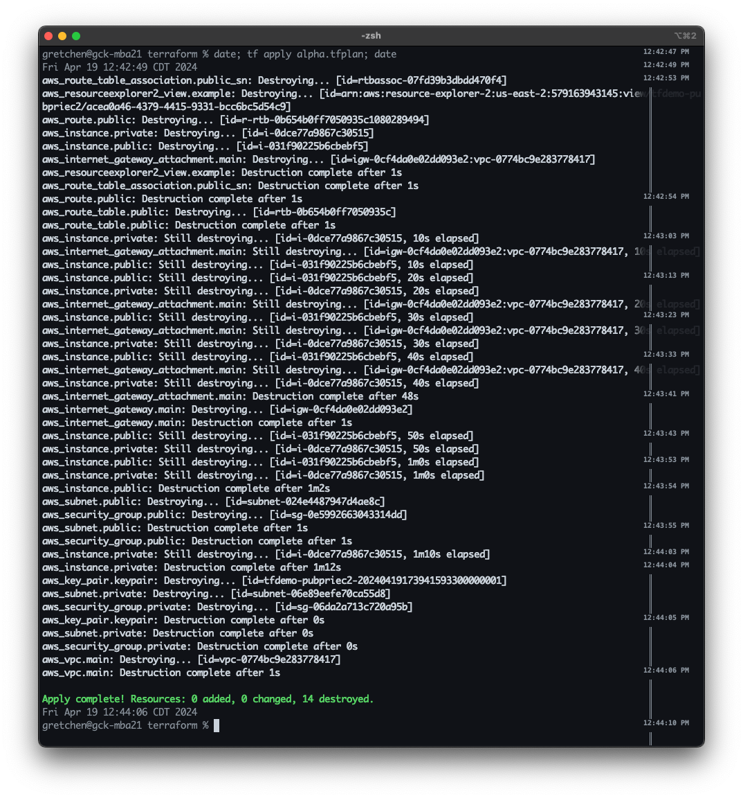

# demo.aws-vpc-public-private-ec2

---

This project creates a new VPC with public and private subnets, routing, and two EC2 nodes. 

The following resources are created, INCLUDING the custom AWS Resource Explorer view:

The project deploys from scratch in less than one minute:

And can be completely destroyed in about the same:

### Resources created:

- Resource Explorer View
- Networking
  - VPC
  - Public Subnet
  - Private Subnet
  - VPC Internet Gateway
  - Route Table
- Compute
  - Key Pairs
  - Security Groups
- Compute Instances
  - t3.micro EC2 in public subnet
  - t3.micro EC2 in private subnet
